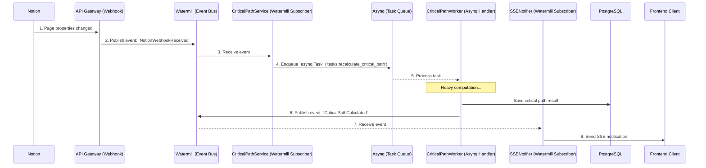

# Event-Driven Architecture with Watermill and Asynq

This document describes the Event-Driven Architecture implemented in our backend. The goal is to create a flexible, scalable, and maintainable system by clearly separating component responsibilities using an **internal Event Bus**.

## 1. Chosen Technologies

1.  **Watermill (Event Bus / "Nervous System"):**
    *   **Role:** Serves as the central communication system in the application. Its job is to broadcast domain events (e.g., `TaskWasUpdated`) to all interested parts of the system.
    *   **Why:** It enables loose coupling between modules. Components don't need to know about each other; they only react to the events that interest them.

2.  **Asynq (Task Queue / "Workforce"):**
    *   **Role:** Serves as the engine for executing heavy, long-running, or retry-able background tasks. It operates based on specific `Task` types, each with a defined `Payload`.
    *   **Why:** It protects the main application (API) from being blocked and ensures the reliability of operations that might fail, providing features like automatic retries and a dashboard for monitoring.

## 2. Detailed Data Flow: Updating a Task in Notion

To illustrate how these two tools work together, let's trace the full lifecycle of an event.

  <!-- Placeholder for a real diagram -->



### Step-by-Step Breakdown:

1.  **Webhook Reception:** Our public endpoint `POST /api/v1/webhooks/notion` receives a notification from Notion and verifies it.

2.  **Event Publication:** The handler publishes a raw event (e.g., `NotionWebhookReceived`) to the Watermill event bus.

3.  **Event Subscription:** A Watermill subscriber, such as `CriticalPathService`, listens for relevant events (e.g., `TaskPropertiesUpdated`).

4.  **Delegating Heavy Work:** `CriticalPathService`'s job is to delegate. It uses an `asynq.Client` to create and enqueue a new `asynq.Task`. The task has a defined **Type** (e.g., `"tasks:recalculate_critical_path"`) and a JSON **Payload** (e.g., `{"project_id": "..."}`).

5.  **Asynchronous Execution:** A separate `job_worker` process, running an `asynq.Server`, picks up the task. It uses an `asynq.ServeMux` to route the task type to the correct handler function (e.g., `HandleRecalculateCriticalPathTask`). This handler performs the heavy computation.

6.  **Result Publication:** After finishing, the Asynq handler publishes a result event (e.g., `CriticalPathCalculated`) back to the Watermill bus.

7.  **Frontend Notification:** The `SSENotifier` (another Watermill subscriber) listens for result events and pushes updates to the client via Server-Sent Events.

## 3. Benefits of this Architecture

*   **Flexibility:** We can easily add new features by creating new subscribers without modifying existing code.
*   **Scalability:** Each component (API, event workers, job workers) can be scaled independently.
*   **Resilience:** An error in a heavy job worker will not crash the event listeners. The job can be retried automatically by Asynq.
*   **Testability:** Each subscriber and worker is a small, isolated unit that can be easily tested.

## 4. Domain Events & Feature Implementation

This section details the concrete events and tasks for implementing our core features.

### Core Events & Tasks

*   **Watermill Event:** `NotionWebhookReceived` - Raw webhook payload.
*   **Watermill Event:** `TaskPropertiesUpdated` - Carries `{ "project_id": "...", "notion_page_id": "..." }`.
*   **Asynq Task Type:** `tasks:synchronize_page` - Payload: `{ "project_id": "...", "notion_page_id": "..." }`. The handler for this task fetches data from Notion and updates our DB.

---

### Feature: Task Dependencies & Automatic Rescheduling

| Trigger | Watermill Event | Subscriber & Action | Asynq Task Type | Asynq Task Payload | Asynq Worker Logic | Final Watermill Event |
| :--- | :--- | :--- | :--- | :--- | :--- | :--- |
| User changes a task's **end date** in Notion. | `TaskPropertiesUpdated` | **`DependencyService`**: Listens for the event. If a date changed, it finds all dependent tasks. | `tasks:reschedule_dependencies` | `{ "source_task_id": "..." }` | 1. Fetches all dependent tasks.<br>2. Calculates new dates.<br>3. **Calls Notion API** to update dates.<br>4. Updates local DB. | `DependentTasksRescheduled` |

---

### Feature: Critical Path Calculation

| Trigger | Watermill Event | Subscriber & Action | Asynq Task Type | Asynq Task Payload | Asynq Worker Logic | Final Watermill Event |
| :--- | :--- | :--- | :--- | :--- | :--- | :--- |
| Any task's date or dependency is modified. | `TaskPropertiesUpdated`, `TaskDependencyChanged` | **`CriticalPathService`**: Listens for the event. | `tasks:recalculate_critical_path` | `{ "project_id": "..." }` | 1. Fetches task graph.<br>2. Performs critical path algorithm.<br>3. Updates `is_critical` flag on tasks in DB. | `CriticalPathCalculated` |

## 5. Code Structure & Runtime Model

We will use a **monorepo** for our Go project, but we will run the application as **multiple, separate processes** for scalability and resilience. This structure adheres to DDD principles by keeping all domain-related logic, including infrastructure handlers, within their respective modules.

### Directory Structure

```
/src/
├── cmd/
│   ├── api/                  # Entry point for HTTP API Server
│   ├── event_worker/         # Entry point for Watermill subscribers
│   └── job_worker/           # Entry point for Asynq job handlers
│
├── internal/
│   ├── modules/
│   │   ├── projects/
│   │   │   ├── application/
│   │   │   │   ├── project_service.go
│   │   │   │   └── tasks/            // Asynq Task definitions (like DTOs for jobs)
│   │   │   │       └── critical_path.go
│   │   │   ├── domain/
│   │   │   │   ├── project.go
│   │   │   │   └── events/           // Domain Event definitions
│   │   │   │       └── events.go
│   │   │   └── infrastructure/
│   │   │       ├── http/             // HTTP handlers for this module
│   │   │       ├── events/           // Watermill Subscriber handlers
│   │   │       ├── jobs/             // Asynq Job handlers
│   │   │       └── postgres/         // Repository implementation
│   │   │
│   │   └── ... (other modules like users, tasks)
│   │
│   └── pkg/
│       ├── eventbus/           # Generic Watermill setup (Publisher, Router)
│       └── taskqueue/          # Generic Asynq setup (Client, Server)
│       └── ... (other shared packages)
```

### Runtime Model (docker-compose.yml)

The `cmd` entry points are responsible for wiring together and running the correct components. We will define separate, independently scalable services for each process type.

```yaml
services:
  # API Gateway: Receives webhooks and user requests. Registers HTTP handlers.
  api:
    build: .
    command: ["./main", "api"]

  # Event Workers: Listens to Watermill topics. Registers event subscriber handlers.
  event_worker:
    build: .
    command: ["./main", "event_worker"]
    deploy:
      replicas: 2 # Scale based on event volume

  # Job Workers: Processes heavy Asynq tasks. Registers job handlers.
  job_worker:
    build: .
    command: ["./main", "job_worker"]
    deploy:
      replicas: 4 # Scale based on job complexity and load
```

This separation ensures that a spike in heavy jobs (e.g., 100 critical path calculations) can be handled by scaling `job_worker` replicas without affecting the real-time processing of incoming events by the `event_worker`.
